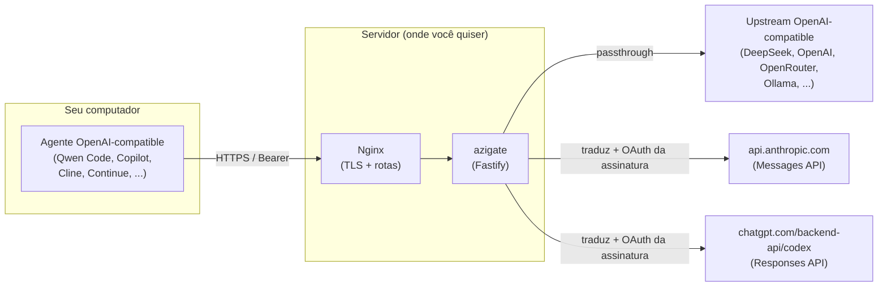
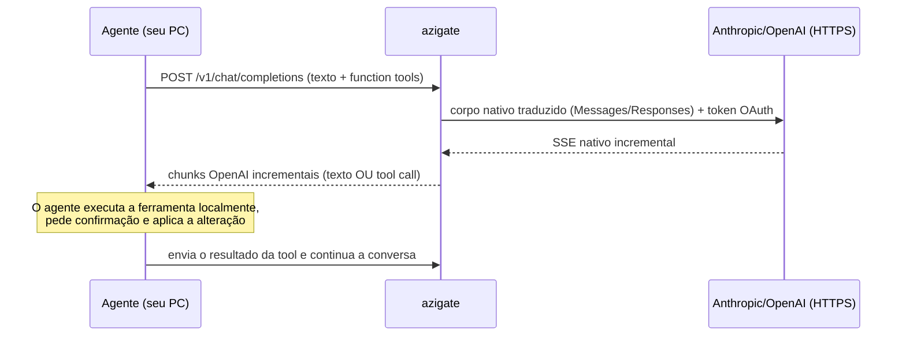

# azigate

`azigate` é um gateway **OpenAI-Compatible** self-hosted. Ele publica um endpoint
no formato da API OpenAI (`/v1/...`) que **qualquer agente ou IDE com a opção
"OpenAI compatible API"** consegue consumir — por exemplo Qwen Code, GitHub Copilot,
Cline ou Continue.

Por trás desse endpoint único, o gateway:

- faz **passthrough** para um **provedor de upstream OpenAI-compatible** escolhido
  pelo operador (o caminho padrão); e
- pode publicar **aliases opcionais** (`codex-cli-*`, `claude-cli-*`) que falam
  HTTP diretamente com a Responses API da OpenAI (Codex) e a Messages API da
  Anthropic (Claude), autenticados pela assinatura do operador via OAuth.

O upstream é configurável: por padrão a **DeepSeek**, mas você pode apontar para
**OpenAI, OpenRouter, Together AI, Groq, Mistral** ou um servidor local
(**Ollama, LM Studio, vLLM**) — qualquer API que exponha `/models` e
`/chat/completions` no formato OpenAI. Veja [Configurar o upstream](#configurar-o-upstream).

O serviço **não é um proxy aberto**. A superfície HTTP é fechada e permanece
limitada a quatro rotas: `GET /health`, `GET /ready`, `GET /v1/models` e
`POST /v1/chat/completions`.

## Como funciona

O agente cliente roda no seu computador (junto do VS Code e dos repositórios). Ele
escolhe um provedor apenas pelo campo `model` e envia o histórico e as function
tools ao gateway. O gateway traduz a requisição para o formato nativo do provedor
certo e devolve texto ou tool calls — mas **nunca executa ferramentas locais**.



### Modelo de segurança: o agente é o único executor

Para os aliases `codex-cli-*` e `claude-cli-*`, o Codex/Claude recebem **somente
texto e os esquemas das function tools**. Eles decidem *o que* fazer e devolvem uma
tool call, mas **quem executa a ferramenta é o agente no seu computador**, com as
confirmações que você já usa. O repositório, o `cwd`, o home completo e as
ferramentas locais nunca chegam ao gateway — não há mais subprocesso, sandbox nem
socket local: a garantia é estrutural, porque o gateway nunca executa nada além de
tradução e chamadas HTTP.



## O que o gateway oferece

- **Passthrough do upstream:** preserva SSE byte a byte, `tool_calls`, `reasoning`,
  `usage`, campos futuros e o `[DONE]`. Funciona com qualquer provedor
  OpenAI-compatible (DeepSeek, OpenAI, OpenRouter, Ollama, etc.).
- **Aliases Codex** (`codex-cli-*`): selecionam modelos GPT fixos via Responses
  API, com effort normalizado (`max` vira `xhigh`), streaming incremental real e
  suporte nativo a multimodal/structured outputs. São *fail-closed* e nunca caem
  automaticamente no upstream.
- **Aliases Claude** (`claude-cli-*`): selecionam modelos Claude fixos via
  Messages API, com effort normalizado por modelo e as mesmas capacidades nativas.
- **Sem vazamento de credenciais:** cada adaptador reconstrói sua própria
  `Authorization` a partir do seu próprio segredo (token OAuth da assinatura para
  Codex/Claude, chave própria para o upstream); a credencial Bearer do cliente
  nunca segue adiante.
- **Superfície fechada e autenticada:** quatro rotas, Bearer obrigatório,
  allowlists de IP e de modelo, rate limit local.
- **Logs mínimos:** nenhum prompt, código, body, resposta, tool argument ou secret
  é registrado. O stdout apenas colore cada alias conhecido e registra o `effort`
  seguro efetivamente usado.

## Onde rodar (casos de uso)

O gateway é self-hosted e não impõe uma topologia. Rode-o onde fizer sentido:

- **Localhost / desenvolvimento:** o agente e o gateway na mesma máquina, para
  testar rápido.
- **Servidor doméstico ou lab:** uma máquina Linux dedicada na sua rede.
- **Rede local (LAN):** vários dispositivos da casa/escritório consumindo o mesmo
  gateway.
- **LAN via VPN (o caso que motivou o projeto):** você acessa o gateway na sua rede
  local a partir de fora, através de uma VPN.
- **VPS / nuvem:** atrás de Nginx com TLS e allowlists.

Em todos os casos o gateway continua **fechado e autenticado**: Bearer obrigatório,
allowlist de IP e de modelo e rate limit valem independentemente de onde ele roda.
Não é um proxy aberto.

## Requisitos

- Linux, macOS ou Windows (WSL2) — o gateway não depende mais de Bubblewrap/user
  namespaces, apenas de rede de saída para os provedores.
- Node.js `>=20.18.1` para desenvolvimento; a imagem usa Node.js 22.
- Docker/Compose e (opcional) Nginx para publicar o gateway.
- Uma chave do upstream escolhido (DeepSeek, OpenAI, etc.).
- Para habilitar os aliases Codex/Claude: uma conta com assinatura ativa (ChatGPT
  Plus/Pro/Team para Codex, Claude Pro/Max/Team para Claude) e o login OAuth feito
  uma vez via `npm run login:codex`/`npm run login:claude` (veja abaixo).

## Comece por aqui

Guias didáticos, do zero ao primeiro request:

1. [Instalação no Linux](docs/installation/linux.md)
2. [Instalação no Windows (WSL2)](docs/installation/windows-wsl2.md)
3. [Configurar seu agente OpenAI-compatible](docs/operations/openai-compatible-agents.md)
   (Qwen Code, GitHub Copilot, Cline, Continue e genérico)

## Habilitar os aliases Codex/Claude (OAuth da assinatura)

Os aliases `codex-cli-*`/`claude-cli-*` autenticam com a **assinatura** do
operador via OAuth, do mesmo jeito que o `codex login`/`claude` oficiais — não são
API keys pagas por token (ver [ADR-018](adr/ADR-018-credencial-oauth-da-assinatura.md)).
Para habilitar:

```bash
npm run login:codex -- secrets/codex-oauth.json
npm run login:claude -- secrets/claude-oauth.json
```

Cada comando imprime uma URL; abra-a no navegador, autentique-se e o gateway grava
o token localmente (diretório `0700`, arquivo `0600`) e o renova sozinho quando
expira. Depois, habilite no `.env`:

```bash
ENABLE_CODEX_CLI=true
ENABLE_CLAUDE_CLI=true
CODEX_TOKEN_FILE=secrets/codex-oauth.json
CLAUDE_TOKEN_FILE=secrets/claude-oauth.json
```

Risco aceito e documentado: para o Claude, o gateway não reproduz técnicas de
"cloaking"/fingerprint que imitam o cliente oficial (ver adendo do ADR-018) — a
Anthropic pode, em tese, detectar e limitar esse acesso como cliente não-oficial.

## Configurar o upstream

O upstream é definido pelo operador em duas variáveis (nomes históricos; apontam
para qualquer provedor OpenAI-compatible):

| Variável | Uso |
|---|---|
| `DEEPSEEK_BASE_URL` | raiz da API OpenAI-compatible; normalmente termina em `/v1` (ex.: `https://api.openai.com/v1`). Default: `https://api.deepseek.com` |
| `DEEPSEEK_API_KEY` | chave enviada como `Authorization: Bearer` ao upstream |

Exemplos de base URL: `https://api.deepseek.com`, `https://api.openai.com/v1`,
`https://openrouter.ai/api/v1`, `https://api.groq.com/openai/v1`. O gateway só
constrói os paths `models` e `chat/completions` sobre essa base. Em produção a base
precisa ser **HTTPS**; endpoints locais em `http://` (Ollama, LM Studio, vLLM) só
são aceitos em desenvolvimento ou atrás do seu próprio TLS.

## Modelos disponíveis

Você seleciona o provedor apenas pelo `model`. Resumo (detalhes de `reasoning_effort`/`reasoning.effort`
e defaults no [guia de agentes](docs/operations/openai-compatible-agents.md)):

| `model` | Provedor | Observação |
|---|---|---|
| qualquer ID permitido do upstream | upstream (DeepSeek por padrão) | passthrough |
| `codex-cli-sol` / `-terra` / `-luna` | Codex (Responses API) | GPT-5.6 Sol / Terra / Luna |
| `codex-cli-5.5` / `codex-cli-5.4` | Codex (Responses API) | GPT-5.5 / GPT-5.4 |
| `codex-cli` | Codex (Responses API) | sinônimo legado de GPT-5.4 |
| `claude-cli-fable-5` / `-sonnet-5` / `-opus-4.8` | Claude (Messages API) | efforts low..max |
| `claude-cli-opus-4.7` / `-opus-4.6` / `-sonnet-4.6` | Claude (Messages API) | ver gate por modelo |
| `claude-cli-sonnet-4.5` / `-haiku-4.5` | Claude (Messages API) | sem effort |
| `claude-cli` | Claude (Messages API) | sinônimo legado de Sonnet 4.6 |

Aliases desabilitados ou sem login OAuth retornam `503 cli_unavailable`; nunca há
fallback automático. Quando `ALLOWED_MODELS` estiver preenchida, inclua
explicitamente cada alias desejado. O catálogo completo e o roteamento estão em
[specs/gateway-api.md](specs/gateway-api.md).

Os aliases CLI agora suportam o mesmo passthrough rico do upstream: multimodal
(imagens/documentos), streaming incremental real token a token e structured
outputs — sem o limite fixo de transcript nem o regime de heartbeat da arquitetura
anterior (ver [ADR-016](adr/ADR-016-substituicao-do-broker-por-adaptadores-http.md)
e [ADR-017](adr/ADR-017-fim-do-regime-sintetico-de-sse.md)).

## Desenvolvimento e gates automatizados

```bash
npm ci --ignore-scripts
npm run check
npm run test:coverage
npm audit --omit=dev --audit-level=high
```

Os testes usam upstream/Anthropic/Codex falsos (servidores HTTP locais) e nunca
consomem serviços reais.

## Segurança e Nginx

O exemplo em [config/nginx/ia.meudominio.com.conf](config/nginx/ia.meudominio.com.conf)
fecha rotas, termina TLS e desativa buffering/compressão/retry oculto. Ajuste
domínio e certificados e valide com `nginx -t`.

Nunca versione o diretório `secrets/` (já está no `.gitignore`). Mantenha a
aplicação restrita à IP allowlist e as confirmações do agente ativas (sem
YOLO/auto-approval).

## Documentação

- [Índice docs-first](docs/index.md)
- [Arquitetura](docs/architecture.md)
- [Providers](docs/modules/providers/index.md)
- [Camada de tradução](docs/modules/translation/index.md)
- [Contrato público](specs/gateway-api.md)
- [Threat model](docs/security/threat-model.md)

## Rollback

Desabilite os dois aliases (`ENABLE_CODEX_CLI=false`, `ENABLE_CLAUDE_CLI=false`) e
recrie o container. O upstream continua funcionando independentemente dos aliases
Codex/Claude.
