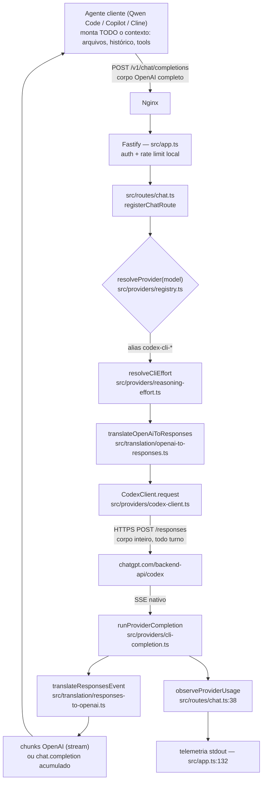

# Azigate — Codex Token Optimization Audit

- Data: 21/09/2026
- Escopo: fluxo Codex (`codex-cli-*`) do `azigate`, da rota HTTP ao corpo enviado à Responses API
- Modo do orquestrador: `architecture-review` (diagnóstico, sem alteração de código)
- Base de evidências: código em `src/` no commit `36a235e` + telemetria real de `logs-terminal.txt` (320 requisições, 21/09/2026, 17:24–20:55) + sessão baseline registrada no ADR-020

> **Aviso de método.** Nenhum finding abaixo é hipótese solta. Cada um aponta arquivo, função e
> linha, ou número medido na telemetria real. Onde a causa raiz não pôde ser provada com os dados
> disponíveis, isso está dito explicitamente e a instrumentação que resolveria a dúvida está
> proposta como ação.

---

## 1. Executive Summary

### Como o Codex é usado

O `azigate` **não é um agente**. Não existe planner, executor, reviewer, critic, subagente, loop de
ferramentas, memória de projeto, índice de repositório, seleção de arquivos ou leitura de workspace
dentro deste repositório. O gateway é *stateless* e traduz, por requisição, um corpo OpenAI Chat
Completions em um corpo Responses API, chama `https://chatgpt.com/backend-api/codex/responses` e
traduz o SSE de volta.

Consequência direta para esta auditoria: **quem monta o contexto é o agente cliente** (Qwen Code,
Copilot, Cline, Continue), na máquina do usuário. O gateway não decide quais arquivos entram no
prompt, nem pode podar histórico sem violar a invariante de passthrough opaco (ADR-002).

Isso **não** significa que não há desperdício. Significa que o desperdício está concentrado em um
lugar específico e mensurável: **o gateway controla os parâmetros que determinam quanto do contexto
reenviado a cada turno é cobrado como token fresco em vez de token cacheado.**

### Onde está o desperdício

A telemetria de 140 requisições `codex-cli-terra` mostra a distribuição real:

```text
input  total : 7.622.827 tokens   (99,4% de todo o volume)
  cacheado   : 3.632.640 (47,65%)
  fresco     : 3.990.187 (52,35%)   <-- o custo real
output total :    45.629 tokens   (0,6%)
  reasoning  :     5.544 (12,2% da saída)
```

A razão input:output é de **167:1**. Qualquer otimização de output, reasoning effort, `summary`,
verbosidade ou structured output mexe em 0,6% do volume. **Otimizar output tokens neste sistema é
irrelevante.** Todo o ganho está no input, e dentro do input todo o ganho está na taxa de cache.

Pior: comparando com a sessão baseline medida no ADR-020 (01/09/2026, mesmo alias), houve
**regressão**:

| Métrica | Baseline ADR-020 (104 req) | Sessão 21/09 (115 req com usage) | Variação |
|---|---|---|---|
| Taxa de cache | 88,7% | 47,65% | **−41 p.p.** |
| Fresco por turno | ~10.010 | ~34.697 | **3,5× pior** |
| Turnos com miss total | 6 | 53 | **8,8× mais** |

Os 53 turnos com miss total consumiram **2.503.648 tokens frescos — 62,7% de todo o input pago da
sessão**.

### Principais oportunidades

1. **TOK-001** — A `prompt_cache_key` do ADR-020 não distingue conversas concorrentes que
   compartilham a âncora. Medição: quando a requisição anterior vinha de outra conversa
   intercalada, o miss total subiu de 31% para **64%**.
2. **TOK-002** — Não há telemetria de *por que* o cache falhou. A chave derivada nunca é registrada,
   o tamanho do payload nunca é medido, a composição do prompt nunca é quebrada. Sem isso,
   qualquer correção de cache é chute.
3. **TOK-003** — `include: ['reasoning.encrypted_content']` é pedido e **descartado**. Os itens de
   reasoning nunca voltam ao `input[]` do turno seguinte, ao contrário do que o Codex CLI oficial
   faz.
4. **TOK-008** — 25 respostas `429` em 10 minutos, cada uma carregando o histórico inteiro no corpo,
   sem propagar `retry-after` ao cliente.
5. **TOK-004/005/006** — Telemetria morta: `freshInputTokens`, `cacheCreationInputTokens` e
   `estimatedCostUsd` são declarados, agregados e logados, mas **nunca escritos**; `snapshot()`
   nunca é exposto por rota; o caminho upstream ignora completamente os campos de cache.

Estimativa de economia agregada, se a taxa de cache voltar à faixa do baseline do ADR-020:
**40–60% do input pago**, equivalente a praticamente a mesma faixa do custo total (dado que input é
99,4% do volume).

---

## 2. Current Architecture

### O que existe de verdade



### O que NÃO existe (verificado por varredura)

Busca por `planner`, `executor`, `critic`, `reviewer`, `subagent`, `agent loop`, `summarize`,
`memory`, `workspace`, `repository index`, `embedding`, `ripgrep`, `ast`, `dependency graph`,
`git diff` dentro de `src/`: **zero ocorrências**. Não há:

- planner/executor/reviewer/critic — as seções 17, 18, 19, 30 e 31 do pedido não têm alvo neste
  repositório;
- seleção de arquivos, leitura de workspace, indexação, embeddings, BM25 — seções 7, 8, 9, 24, 25,
  26, 33 não têm alvo;
- cache semântico ou cache de resultado de tool — seção 27 não tem alvo;
- MCP server, definição de tools própria, tool routing — as tools chegam prontas do cliente e são
  repassadas em `convertTools` (`openai-to-responses.ts:217`), sem o gateway acrescentar nenhuma;
- histórico, sessão ou memória entre requisições — `docs/architecture.md` declara e o código
  confirma: nenhum módulo mantém estado de conversa.

**Isso é uma conclusão, não uma lacuna da auditoria.** As oportunidades listadas neste documento são
as que existem dentro da fronteira real do sistema. Recomendações do tipo "implemente pruning de
histórico" ou "use índice de repositório" pertencem ao agente cliente, não ao `azigate`, e foram
deliberadamente excluídas do backlog (ver seção 9).

---

## 3. Token Flow

Fluxo de **uma** requisição Codex. Cada linha diz o que entra, o que sai e onde há risco de
desperdício.

| Etapa | Origem (arquivo:função) | Conteúdo enviado / adicionado | Possível desperdício |
|---|---|---|---|
| 1. Recepção | `src/routes/chat.ts:73` handler | Corpo OpenAI cru do cliente: `messages` completo, `tools`, `tool_choice`. Limite `MAX_REQUEST_BODY_BYTES` = 10 MiB (`config.ts:132`) | Nenhum no gateway — o volume já chegou pronto. O limite de 10 MiB permite corpo ~2,5M tokens sem aviso |
| 2. Roteamento | `src/providers/registry.ts:12` `resolveProvider` | Nada. Só mapeia alias → modelo interno | Nenhum |
| 3. Effort | `src/providers/reasoning-effort.ts:136` `resolveCliEffort` | Acrescenta `reasoning.effort`; default **sempre `medium`** (`cli-catalog.ts:190-196`) | Todas as 140 requisições medidas usaram `medium`. Sem rota para esforço menor em tarefa trivial (TOK-007) |
| 4. Tradução | `src/translation/openai-to-responses.ts:269` `translateOpenAiToResponses` | Monta `input[]` **inteiro** a cada turno; `instructions: ''`; `store: false`; `reasoning.summary: 'auto'`; `include: ['reasoning.encrypted_content']`; `prompt_cache_key` | **Ponto crítico.** Reconstrução total do contexto por turno; reasoning do turno anterior não volta (TOK-003); chave de cache pouco discriminante (TOK-001); mensagem `user` vazia ainda é emitida (TOK-009) |
| 5. Serialização | `src/routes/chat.ts:165` `JSON.stringify(responsesBody)` | String completa do corpo | Tamanho nunca medido nem registrado (TOK-002) |
| 6. Envio | `src/providers/codex-client.ts:66` `fetch` | Corpo inteiro por HTTPS; retry reenvia o mesmo corpo (`maxRetries` default 0, máx. 2) | Em `429`, corpo inteiro subiu para nada; sem propagação de `retry-after` (TOK-008) |
| 7. Leitura SSE | `src/providers/sse-reader.ts:14` `readSseEvents` | — | Buffer de 50 MiB; eventos `reasoning.encrypted_content` chegam e são descartados silenciosamente (TOK-003) |
| 8. Tradução da resposta | `src/translation/responses-to-openai.ts:71` `translateResponsesEvent` | Converte 9 tipos de evento; ignora todos os outros (`RESPONSES_EVENT_TYPES`, linha 32) | Itens `reasoning` não são repassados nem guardados |
| 9. Usage | `src/routes/chat.ts:38` `observeProviderUsage` | Grava `inputTokens`, `outputTokens`, `cachedInputTokens`, `reasoningOutputTokens`, `cacheHitPercent` | **Não grava `freshInputTokens`** apesar de ser logado e agregado (TOK-004). Usage só existe se `response.completed` chegar: aborto do cliente = turno invisível (TOK-006) |
| 10. Log | `src/app.ts:132` hook `onResponse` | Linha JSON por requisição em stdout | Sem `prompt_cache_key`, sem bytes do corpo, sem contagem de itens/tools (TOK-002). Agregados de `GatewayMetrics.snapshot()` sem rota (TOK-005) |

---

## 4. Main Token Consumers

Ordenado pelo volume medido na sessão de 21/09/2026 (140 requisições `codex-cli-terra`):

| # | Consumidor | Volume | % do total |
|---|---|---|---|
| 1 | **Input fresco (miss total de cache)** — 53 turnos | 2.503.648 | 32,8% |
| 2 | **Input fresco (miss parcial)** — 62 turnos, média 24.369/turno | 1.486.539 | 19,5% |
| 3 | Input cacheado (custo reduzido, mas conta na cota) | 3.632.640 | 47,6% |
| 4 | Output visível (texto + tool arguments) | 40.085 | 0,53% |
| 5 | Reasoning (subconjunto da saída) | 5.544 | 0,07% |

Distribuição do tamanho de input por requisição (buckets de 10k):

```text
  0–10k :  7    50–60k :  8    100–110k :  4
 10–20k :  6    60–70k : 16    110–120k :  6
 20–30k :  9    70–80k : 12    120–130k :  4
 30–40k : 11    80–90k : 14    130–140k :  4
 40–50k :  3    90–100k: 11
```

Máximo observado: **133.502 tokens de input em uma única requisição**. Média: 54.449.

Leitura: 63% dos turnos carregam mais de 50k tokens de contexto. Isso é escolha do agente cliente —
o gateway não pode reduzir. O que o gateway pode fazer é garantir que esses 50k+ sejam **lidos do
cache** em vez de reprocessados.

---

## 5. Findings

### TOK-001 — `prompt_cache_key` não distingue conversas concorrentes

**Local**

```text
src/translation/openai-to-responses.ts
função conversationAnchor         — linhas 197-204
função buildPromptCacheKey        — linhas 208-215
uso em translateOpenAiToResponses — linhas 277-278
ADR-020-prompt-cache-key-derivada-da-conversa.md
```

**Comportamento atual**

A chave é `sha256(qtd_tools + nomes_tools + "\0" + primeiro_texto_user_não_vazio)`, truncada em 32
hex. Mensagens `system` ficam fora de propósito (conteúdo volátil rotacionaria a chave).

**Problema**

A âncora é o **primeiro texto de usuário**. Duas condições reais destroem sua capacidade de
discriminar conversas:

1. **Conversas concorrentes com a mesma abertura.** Duas sessões do mesmo agente, no mesmo repositório,
   frequentemente começam com o mesmo texto. Elas recebem a **mesma** `prompt_cache_key`, são
   roteadas para a **mesma** máquina e seus prefixos — que são diferentes — se despejam mutuamente.
   O próprio ADR-020 registra esse trade-off como consequência aceita; a telemetria de 21/09 mostra
   que ele deixou de ser teórico.
2. **Compactação de histórico pelo agente.** Quando o cliente compacta a conversa, a primeira
   mensagem `user` muda ou some. A chave rotaciona **e** o prefixo muda inteiro: miss total.

**Exemplo atual (telemetria real, 21/09/2026, recorte 17:28–17:30)**

Duas séries intercaladas, uma crescendo de 64k a 71k e outra oscilando entre 11k e 61k:

```text
17:28:35  input 64785  cached     0   hit   0%
17:28:42  input 65534  cached     0   hit   0%
17:28:43  input 21255  cached 10752   hit  50%   <- outra conversa
17:28:54  input 66068  cached     0   hit   0%
17:28:57  input 27079  cached     0   hit   0%   <- outra conversa
17:29:07  input 66629  cached 38400   hit  58%
17:29:18  input 67630  cached 62976   hit  93%
17:29:19  input 38400  cached  7680   hit  20%   <- outra conversa
17:29:30  input 68028  cached 66048   hit  97%
17:29:37  input 52849  cached     0   hit   0%   <- outra conversa
17:29:39  input 68895  cached 67072   hit  97%
17:29:43  input 69140  cached     0   hit   0%   <- prefixo despejado
```

Correlação medida sobre os 114 pares consecutivos da sessão:

```text
requisição anterior = continuação plausível da MESMA conversa
  n=61   miss total: 19 (31%)   fresco/turno: 38.373

requisição anterior = OUTRA conversa intercalada
  n=53   miss total: 34 (64%)   fresco/turno: 30.566
```

**O miss total dobra quando há intercalação.** 28 dos 114 pares têm sobreposição temporal real
(concorrência de fato, não só alternância).

**Proposta**

Acrescentar à âncora um discriminante que seja (a) estável dentro de uma conversa, (b) único entre
conversas, (c) não volátil. O candidato natural já está no corpo: **o `call_id` da primeira tool
call do histórico**. É um identificador gerado pelo fornecedor, devolvido pelo agente em
`tool_call_id` e preservado em `convertMessages` (linhas 170-184). Não muda entre turnos e é
distinto por conversa. Do segundo turno em diante ele existe em qualquer sessão agentic.

**Antes**

```text
key = sha256( tools + "\0" + primeiro_user_text )
→ conversa A e conversa B com a mesma abertura ⇒ MESMA chave
```

**Depois**

```text
ancora = primeiro call_id do histórico  (fallback: primeiro_user_text)
key    = sha256( tools + "\0" + ancora )
→ conversa A e conversa B ⇒ chaves distintas desde o 2º turno
```

Continua função pura, continua sem estado, continua sem expor nada do conteúdo (só o digest sai do
processo). Exige adendo ao ADR-020.

**Impacto esperado:** `MUITO ALTO`
**Complexidade:** `BAIXA`
**Risco:** `BAIXO` — a chave é dica de roteamento, não controle de correção; colisão ou troca nunca
produz resposta errada (registrado no próprio ADR-020).

---

### TOK-002 — Impossível diagnosticar miss de cache: nenhuma dimensão do prompt é medida

**Local**

```text
src/app.ts — hook onResponse, linhas 132-181 (linha de log)
src/routes/chat.ts — observeProviderUsage, linhas 38-50
src/translation/openai-to-responses.ts — linha 278 (chave derivada e nunca registrada)
```

**Comportamento atual**

O log por requisição traz `inputTokens`, `cachedInputTokens`, `cacheHitPercent`,
`reasoningOutputTokens`, `effort`, `upstreamStatus`. Não traz **nada** sobre a forma do prompt.

**Problema**

Com os dados atuais é possível afirmar *que* o cache falhou (TOK-001), mas não *por quê*. As três
causas candidatas — colisão de chave, compactação do cliente, expiração por ociosidade — produzem
exatamente a mesma linha de log. Os buckets por intervalo entre requisições mostram que ociosidade
**não** explica o fenômeno:

```text
gap   0–15s : n=90  miss total 44 (49%)  fresco 55% do input
gap  15–60s : n=17  miss total  5 (29%)  fresco 47%
gap  60–300s: n=5   miss total  2 (40%)  fresco 26%
```

Metade dos misses acontece com menos de 15 segundos entre turnos. Não é TTL.

**Proposta**

Acrescentar ao objeto de telemetria, em `src/routes/chat.ts` (produtor) e `src/app.ts` (log), campos
que são **derivados e não-sensíveis**:

```jsonc
{
  "promptCacheKey": "azigate-a1b2…",   // já é digest opaco; o conteúdo não vaza
  "requestBodyBytes": 218_450,          // JSON.stringify(responsesBody).length
  "inputItemCount": 87,                 // responsesBody.input.length
  "toolCount": 14,                      // responsesBody.tools?.length ?? 0
  "toolSchemaBytes": 9_812,             // JSON.stringify(tools).length
  "prefixFingerprint": "c3f9…"          // sha256 dos 3 primeiros itens de input, 8 hex
}
```

`prefixFingerprint` é o campo decisivo: se ele muda entre turnos consecutivos da mesma chave, a
causa é o cliente reescrevendo o começo da conversa (compactação); se é estável e mesmo assim há
miss, a causa é roteamento/eviction. Uma sessão instrumentada responde a pergunta em minutos.

Nenhum desses campos viola a invariante de não registrar prompts: todos são contagens ou digests.

**Impacto esperado:** `MUITO ALTO` (habilitante — sem isso as demais correções de cache são cegas)
**Complexidade:** `BAIXA`
**Risco:** `BAIXO`

---

### TOK-003 — `reasoning.encrypted_content` é pedido e jogado fora

**Local**

```text
src/translation/openai-to-responses.ts:57   include: ['reasoning.encrypted_content']
src/translation/openai-to-responses.ts:293  (uso)
src/translation/responses-to-openai.ts:32   RESPONSES_EVENT_TYPES — sem nenhum evento de reasoning item
src/translation/openai-to-responses.ts:147  convertMessages — não reconstrói item 'reasoning'
```

**Comportamento atual**

O corpo pede explicitamente o reasoning encriptado. O tradutor de resposta (`RESPONSES_EVENT_TYPES`)
não reconhece nenhum evento de item de reasoning — apenas
`response.reasoning_summary_text.delta`, que é o **resumo** textual, não o item. O
`encrypted_content` chega no SSE e é descartado em `cli-completion.ts:140` (`if (!isEvent(parsed))
continue`). E `convertMessages` só produz três tipos de item: `message`, `function_call`,
`function_call_output`. Nunca `reasoning`.

**Problema**

Com `store: false`, a Responses API só preserva a cadeia de raciocínio entre turnos se os itens de
reasoning forem **devolvidos no `input[]` do turno seguinte** — é exatamente o que o Codex CLI
oficial faz, e o motivo de `include: ['reasoning.encrypted_content']` existir. Hoje o gateway pede o
material e o descarta, então:

- em um loop de tool calls, o modelo **redescobre** a cada turno o raciocínio que já tinha feito;
- a flag `include` fica inerte: pede-se um payload que aumenta a resposta do fornecedor sem nenhum
  consumidor.

Quantificação honesta: reasoning é 5.544 tokens de 45.629 de saída (12,2%), ou **0,07% do volume
total**. O ganho direto em tokens é pequeno. O ganho real é de **qualidade e continuidade** entre
turnos de tool call, e potencialmente de menos turnos — que é onde o input de 54k/turno é gasto.

**Proposta**

Uma de duas, decidida por ADR:

- **(a)** Implementar o round-trip: reconhecer o item de reasoning no stream, expô-lo ao cliente em
  campo opaco e reinjetá-lo em `convertMessages`. Preserva a cadeia como o CLI oficial.
- **(b)** Remover `include: ['reasoning.encrypted_content']`, assumindo por escrito que o azigate
  não preserva cadeia de raciocínio entre turnos.

O que não se sustenta é o estado atual: pedir e descartar.

**Antes**

```text
turno N   : modelo raciocina → encrypted_content emitido → descartado
turno N+1 : input[] sem nenhum item de reasoning → modelo raciocina de novo
```

**Depois (opção a)**

```text
turno N   : encrypted_content capturado e devolvido ao cliente
turno N+1 : input[] = [...histórico, reasoning(encrypted), novos itens]
```

**Impacto esperado:** `MÉDIO` (tokens) / `ALTO` (qualidade e número de turnos)
**Complexidade:** `MÉDIA` — opção (a) exige campo novo no contrato de saída e no de entrada
**Risco:** `MÉDIO` — reinjetar item malformado provoca `400` na Responses API; exige teste de
regressão dedicado

---

### TOK-004 — `freshInputTokens` é logado e agregado, mas nunca calculado

**Local**

```text
src/types.ts:15                 freshInputTokens?: number        (declarado)
src/observability/metrics.ts:9  freshInputTokensTotal            (agregado)
src/observability/metrics.ts:55 fresh_input_tokens_total         (exposto no snapshot)
src/app.ts:111 e :147           lido para métrica e para o log
src/routes/chat.ts:38-50        observeProviderUsage — NUNCA escreve o campo
```

**Comportamento atual**

Quatro pontos do código leem `telemetry.freshInputTokens`. Nenhum o escreve. Idem para
`cacheCreationInputTokens` e `estimatedCostUsd`.

**Problema**

`docs/architecture.md` documenta a regra `freshInputTokens = input − cached` para Codex. A regra
está escrita, agregada e logada — e nunca executada. Confirmação nos dados: **0 ocorrências de
`freshInputTokens` em 320 linhas de log reais**. O operador precisa derivar o número à mão, como
esta auditoria precisou fazer. `fresh_input_tokens_total` e `estimated_cost_usd_total` são sempre 0.

**Proposta**

Calcular em `observeProviderUsage`, logo depois de `cacheHitPercent` (linha 47-49), que já faz
exatamente a mesma aritmética para produzir a porcentagem.

**Antes**

```text
observeProviderUsage → inputTokens, cachedInputTokens, cacheHitPercent
log                  → freshInputTokens ausente em 100% das linhas
```

**Depois**

```text
freshInputTokens = prompt_tokens − (prompt_tokens_details.cached_tokens ?? 0)
```

**Impacto esperado:** `MÉDIO` (métrica de acompanhamento — é o número que mede todas as outras ações)
**Complexidade:** `BAIXA`
**Risco:** `BAIXO`

---

### TOK-005 — `GatewayMetrics.snapshot()` não tem rota: agregados inalcançáveis

**Local**

```text
src/observability/metrics.ts:45  snapshot()
src/routes/health.ts             registra apenas /health e /ready
grep "snapshot()" src/           → só a definição
grep "snapshot()" test/          → só asserções de teste
```

**Comportamento atual**

Quatorze contadores agregados (`input_tokens_total`, `cached_input_tokens_total`,
`reasoning_output_tokens_total`, …) são mantidos em memória e nunca expostos. A única observabilidade
real é o log linha a linha em stdout.

**Problema**

Para medir se qualquer otimização funcionou, hoje é preciso capturar `docker compose logs`, filtrar
e agregar com script — literalmente o que foi feito nesta auditoria. Não há linha de base contínua,
não há taxa de acerto agregada, não há como detectar regressão como a de 88,7% → 47,65% sem alguém
reparar por acaso.

A invariante de superfície HTTP fechada (`/health`, `/ready`, `/v1/models`,
`/v1/chat/completions`) é explícita em `CLAUDE.md` e em `docs/security/endpoint-inventory.md`, então
**uma rota `/metrics` pública não é aceitável sem decisão arquitetural**. Alternativas compatíveis:

- expor em porta separada, ligada somente ao loopback/rede interna, fora do Nginx público;
- emitir um log de agregado periódico (`metrics_snapshot`) em intervalo configurável;
- manter o snapshot atrás da mesma autenticação Bearer, com entrada correspondente no inventário de
  endpoints, no threat model e nas specs.

**Impacto esperado:** `ALTO` (habilitante)
**Complexidade:** `BAIXA` (log periódico) a `MÉDIA` (rota nova, que exige ADR + specs + threat model)
**Risco:** `BAIXO` (log) / `MÉDIO` (rota — amplia superfície)

---

### TOK-006 — Turnos sem `response.completed` somem da telemetria

**Local**

```text
src/providers/cli-completion.ts:169   if (lastUsage !== undefined) input.observeUsage(...)
src/translation/responses-to-openai.ts:157-171   usage só em response.completed / response.incomplete
```

**Comportamento atual**

`usage` só é observado se o evento final chegar. Aborto do cliente, timeout, erro de stream ou `429`
resultam em requisição logada **sem nenhum campo de token**.

**Problema**

Na sessão medida, **25 de 140 requisições Codex (17,9%) não têm usage algum**. São os `429`. Elas
custaram banda e cota de plano, e no agregado aparecem como se não tivessem existido. Qualquer média
de "tokens por requisição" calculada a partir deste log subestima o consumo real, e um pico de
cancelamentos fica invisível.

**Proposta**

Registrar sempre a dimensão que o gateway conhece mesmo sem usage: `requestBodyBytes` e
`inputItemCount` (já propostos em TOK-002), mais um campo `usageObserved: false`. Assim o turno
existe no log com tamanho conhecido, ainda que o fornecedor não tenha reportado tokens.

**Impacto esperado:** `MÉDIO`
**Complexidade:** `BAIXA`
**Risco:** `BAIXO`

---

### TOK-007 — Effort fixo em `medium`, sem rota para tarefa barata

**Local**

```text
src/cli-catalog.ts:190-196   CODEX_MODEL_CATALOG — defaultEffort 'medium' nos 5 modelos
src/providers/reasoning-effort.ts:146-152   resolveCliEffort
src/cli-catalog.ts:214-220   CLI_ALIAS_CATALOG — aliases por modelo, nenhum por esforço
```

**Comportamento atual**

Se o cliente não manda `reasoning_effort` nem `reasoning.effort`, o esforço é `medium`. Agentes como
o Qwen Code normalmente não mandam. Evidência: **as 140 requisições da sessão usaram `effort:
"medium"`, sem uma única exceção.**

**Problema**

Não existe caminho prático para o operador pedir esforço menor em tarefa trivial. Os aliases
discriminam modelo (`codex-cli-terra`, `codex-cli-5.5`), nunca esforço.

**Dimensionamento honesto:** reasoning é 0,07% do volume total de tokens desta sessão. **O ganho em
tokens é desprezível.** O ganho real é latência: a duração média por requisição Codex foi de 8.735 ms,
com picos de 66 s. Se o objetivo declarado é token, esta ação é de baixa prioridade; se é
experiência de uso, é relevante.

**Proposta**

Aliases com sufixo de esforço (`codex-cli-terra-low`, `codex-cli-terra-high`), mantendo o registry
fechado e a allowlist interna. Não muda o contrato público além do catálogo de modelos, que já é
enumerado em `ALLOWED_MODELS` e em `/v1/models`.

**Impacto esperado:** `BAIXO` (tokens) / `MÉDIO` (latência)
**Complexidade:** `BAIXA`
**Risco:** `BAIXO`

---

### TOK-008 — `429` sem `retry-after` propagado, com histórico inteiro no corpo

**Local**

```text
src/providers/http-errors.ts:21   ProviderUpstreamError — só status, code e mensagem
src/providers/cli-completion.ts:122-124   throw ProviderUpstreamError(provider, status)
src/upstream/response.ts:9        RESPONSE_HEADERS inclui 'retry-after' — só no caminho upstream
```

**Comportamento atual**

No caminho upstream (DeepSeek), `retry-after` é repassado ao cliente (`upstream/response.ts:9`). No
caminho Codex, a resposta do fornecedor é descartada e substituída por um corpo de erro sanitizado
sem nenhum cabeçalho de backoff.

**Problema**

Telemetria real de 21/09/2026: **25 respostas `429`**, concentradas em duas rajadas
(19:52–19:55, 13 respostas; 20:00–20:02, 12 respostas), a cada 20–30 segundos, todas
`codex-cli-terra`. Cada tentativa subiu o histórico completo — nessa fase da sessão, na faixa de
80k–130k tokens — para receber `429`.

Sem `retry-after`, o agente cliente não tem sinal de backoff e volta imediatamente, realimentando a
exaustão de cota. O retry interno do gateway não agravou o quadro nesta sessão
(`UPSTREAM_MAX_RETRIES` default é 0, `config.ts:140`), mas o teto permitido é 2 e o backoff base é
de 100 ms (`codex-client.ts:93`) — agressivo demais para `429` de cota.

**Proposta**

1. Propagar `retry-after` do fornecedor para o cliente no caminho CLI, como já é feito no upstream.
   O cabeçalho não vaza conteúdo e é justamente o mecanismo de backpressure padrão.
2. Para `429` especificamente, respeitar `Retry-After` em vez do exponencial de base 100 ms —
   `parseRetryAfter` já existe em `http-retry.ts:3` e é consultado, mas o exponencial ainda é o
   caminho padrão quando o cabeçalho está ausente.

**Impacto esperado:** `ALTO` (evita rajadas de reenvio de contexto inteiro)
**Complexidade:** `BAIXA`
**Risco:** `BAIXO`

---

### TOK-009 — Mensagem `user` sem conteúdo convertível ainda é emitida no `input[]`

**Local**

```text
src/translation/openai-to-responses.ts:160-164
```

**Comportamento atual**

```ts
if (role === 'user') {
  const content = convertUserOrAssistantContent(raw.content, 'input_text')
  items.push({ type: 'message', role: 'user', content })   // sem checar content.length
  continue
}
```

Para `system` (linha 156) e `assistant` (linha 168) há guarda `if (content.length > 0)`. Para `user`,
não.

**Problema**

Uma mensagem `user` cujo conteúdo não produza nenhuma parte convertível — parte de tipo
desconhecido, array vazio, `content: null` — vira `{type:'message', role:'user', content:[]}` no
`input[]`. É um item sem informação ocupando posição no prefixo. Se aparecer no meio do histórico,
introduz ruído em exatamente a estrutura que precisa ser byte-a-byte idêntica entre turnos para o
cache de prefixo funcionar.

O impacto em tokens por ocorrência é pequeno. A relevância é de **consistência do prefixo**, e a
inconsistência com os outros dois ramos sugere omissão, não decisão.

**Proposta**

Uniformizar com os demais ramos, ou documentar por que `user` vazio precisa ser preservado (pode
haver motivo: a Responses API rejeita `input[]` vazio, e há turnos legítimos só com
`function_call_output`).

**Impacto esperado:** `BAIXO`
**Complexidade:** `BAIXA`
**Risco:** `BAIXO` — exige teste que confirme o comportamento com histórico só de tool results

---

### TOK-010 — Caminho upstream ignora campos de cache (contamina a linha de base)

**Local**

```text
src/upstream/response.ts:21-31   tokenUsage — lê só prompt_tokens, completion_tokens, total_tokens
src/translation/anthropic-to-openai.ts:6 e :17 — lê só input_tokens e output_tokens
```

**Comportamento atual**

`tokenUsage` no caminho upstream não lê `prompt_tokens_details.cached_tokens` nem os campos
equivalentes do provedor configurado (a DeepSeek usa `prompt_cache_hit_tokens` /
`prompt_cache_miss_tokens`). O tradutor Anthropic ignora `cache_creation_input_tokens` e
`cache_read_input_tokens`.

**Problema**

Medido: **180 requisições `deepseek-v4-flash`, 21.356.690 tokens de input, `cachedInputTokens` = 0 em
100% delas.** Não é plausível que um provedor com cache de contexto tenha 0% de acerto em 21 milhões
de tokens; é o parser que não lê o campo.

No caminho Anthropic, a ausência de `cache_creation_input_tokens`/`cache_read_input_tokens` é
**reincidência**: o incidente de 20/07/2026
(`docs/operations/incidents/2026-07-20-telemetria-cli-incompleta-e-reenvio-de-contexto.md`) descreve
exatamente esse bug como corrigido, e a reescrita para adaptadores HTTP (ADR-016) o reintroduziu. Os
campos `cacheCreationInputTokens`/`cacheReadInputTokens` continuam declarados em `types.ts:17-18` e
agregados em `metrics.ts:11-12`, sem produtor.

**Fora do escopo Codex**, mas relatado porque: (a) contamina qualquer comparação entre provedores;
(b) confirma que a ausência de teste de regressão de telemetria é sistêmica e vai repetir o problema.

**Impacto esperado:** `ALTO` (para observabilidade; nulo para o consumo Codex)
**Complexidade:** `BAIXA`
**Risco:** `BAIXO`

---

## 6. Quick Wins

Alto impacto + baixo risco + baixa complexidade. Na ordem em que devem ser executados:

1. **TOK-002** — instrumentar `promptCacheKey`, `requestBodyBytes`, `inputItemCount`, `toolCount`,
   `toolSchemaBytes`, `prefixFingerprint`. Habilita todo o resto. Nenhum campo sensível.
2. **TOK-004** — calcular `freshInputTokens` em `observeProviderUsage`. Quatro leitores já esperam
   o campo.
3. **TOK-001** — usar o primeiro `call_id` do histórico como âncora da `prompt_cache_key`, com
   fallback para o texto atual. Função pura, sem estado, adendo ao ADR-020.
4. **TOK-008** — propagar `retry-after` no caminho CLI, como já se faz no upstream.
5. **TOK-006** — registrar `usageObserved: false` e o tamanho do corpo quando o turno não reporta
   usage.
6. **TOK-010** — ler os campos de cache do upstream e do Anthropic, com teste de regressão para não
   perder de novo.

---

## 7. Architectural Improvements

### AI-01 — Reuso de contexto no servidor via `store: true` + `previous_response_id`

**A maior economia teórica disponível, e a de maior risco.**

Hoje cada turno reenvia o `input[]` inteiro (`openai-to-responses.ts:280`) com `store: false` fixo
(linha 288). A Responses API oferece o caminho alternativo: guardar a resposta no fornecedor e, no
turno seguinte, enviar `previous_response_id` mais **apenas os itens novos**.

Efeito nos números medidos: em vez de transmitir 54.449 tokens por turno e torcer pelo cache
implícito, o turno passa a transmitir a ordem de 2–5k tokens com reuso determinístico do contexto
anterior. Elimina a classe inteira de problemas do TOK-001, porque para de depender de roteamento
por chave.

**Por que não é um quick win:**

- exige **estado** no gateway (mapa conversa → `response_id`), com expiração e limite de memória,
  contra `docs/architecture.md` ("totalmente stateless") e o ADR-001. O ADR-020 já rejeitou
  introduzir estado de sessão para um objetivo menor;
- `store: true` faz a conversa ser **retida no fornecedor**. É mudança de fronteira de confiança:
  exige atualização de `docs/security/threat-model.md` e é incompatível com qualquer requisito de
  retenção zero;
- correção fica frágil quando o cliente edita, compacta ou reordena o histórico — o gateway
  precisaria detectar divergência e cair para o modo completo;
- não há confirmação de que o backend `chatgpt.com/backend-api/codex` honra `store`/
  `previous_response_id` do mesmo modo que a API pública. **Precisa de prova antes de qualquer
  decisão.**

**Encaminhamento:** teste manual isolado (fora da suíte, como `gate:codex`) para verificar suporte;
se confirmado, ADR com as alternativas, trade-offs e o modo de fallback.

**Impacto esperado:** `MUITO ALTO`
**Complexidade:** `ALTA`
**Risco:** `ALTO`

### AI-02 — Teste de regressão de telemetria como gate

O mesmo bug de telemetria de cache foi corrigido em 20/07/2026 e reintroduzido na migração do ADR-016
(TOK-010). O `CLAUDE.md` já exige teste de regressão para "autenticação, sanitização, allowlists,
roteamento, protocolo interno, saída CLI, streaming e cancelamento" — **telemetria de usage não está
na lista**. Acrescentar, com casos de tabela nos tradutores, que são funções puras e baratas de
testar.

**Impacto esperado:** `MÉDIO` (preventivo)
**Complexidade:** `BAIXA`
**Risco:** `BAIXO`

### AI-03 — Guarda de contexto por tamanho

`MAX_REQUEST_BODY_BYTES` é 10 MiB (`config.ts:132`), o que permite corpo de ~2,5 milhões de tokens
sem nenhum aviso. O incidente de 20/07/2026 registra que a arquitetura anterior bloqueava contexto
acima de 256 KiB antes do provider; a arquitetura atual não tem equivalente. O maior input observado
foi de 133.502 tokens em uma requisição.

Um limiar de **alerta** (não de bloqueio) por tamanho de corpo, emitido no log, daria sinal precoce de
agente com contexto descontrolado sem alterar o contrato. Bloqueio exigiria ADR.

**Impacto esperado:** `MÉDIO`
**Complexidade:** `BAIXA`
**Risco:** `BAIXO` (alerta) / `MÉDIO` (bloqueio)

---

## 8. Prompt Optimization

Levantamento dos prompts que o `azigate` efetivamente controla. São poucos — o prompt real vem do
agente cliente.

### Prompt 1 — `instructions`

```text
atual:    instructions: ''            (openai-to-responses.ts:288)
problema: nenhum. É a escolha certa.
```

Zero tokens injetados pelo gateway. O system prompt do cliente vai como item `developer`
(linha 156). Não há prompt de sistema próprio, não há instrução duplicada, não há regra de agente
repetida. **Nada a otimizar.** As seções 10 e 12 do pedido (prompts repetidos, ordenação
estático/dinâmico) não têm alvo: o gateway não acrescenta nenhum bloco ao prompt.

### Prompt 2 — `reasoning.summary: 'auto'`

```text
atual:    reasoning: { effort, summary: 'auto' }   (linha 292)
problema: o resumo de raciocínio é gerado sempre e vira reasoning_content no stream
          (responses-to-openai.ts:84-87). Muitos clientes OpenAI-compatible descartam
          esse campo silenciosamente.
sugestão: tornar o summary configurável por variável de ambiente, default preservado.
redução:  ~12% do output = ~0,07% do volume total.
```

**Recomendação explícita: não priorizar.** Mesmo eliminando 100% do reasoning, a economia sobre o
total medido fica abaixo de 0,1%. Está listado para fechar a pergunta, não porque valha a pena.

### Prompt 3 — ordenação do corpo Responses

```text
atual:  model, instructions, store, stream, [parallel_tool_calls], reasoning,
        include, [prompt_cache_key], input, [tools], [tool_choice], [text]
```

A ordem é determinística e os campos estáveis vêm antes do `input`. Não há timestamp, UUID, valor
aleatório nem ordenação variável no prefixo — `buildShortNameMap` é determinístico sobre a ordem
recebida, e `prompt_cache_key` é digest estável. **A construção do corpo está correta do ponto de
vista de estabilidade de prefixo.** O problema do TOK-001 é de roteamento, não de ordenação.

### Componentes do prompt — medição

Quanto cada componente (system, histórico, arquivos, definições de tool, tool outputs) pesa dentro
dos 54.449 tokens médios:

```text
Não mensurável sem telemetria.
```

Exatamente o que TOK-002 propõe medir (`toolSchemaBytes`, `inputItemCount`, `requestBodyBytes`).
Até lá, qualquer afirmação sobre "as tools custam X%" seria invenção.

---

## 9. Context Optimization

Avaliação de cada técnica pedida contra a arquitetura real:

| Técnica | Aplicável ao azigate? | Justificativa |
|---|---|---|
| **Context pruning / sliding window** | ❌ Não | Violaria o passthrough opaco (ADR-002). O gateway não pode decidir que a mensagem 12 do cliente é descartável — ele não sabe o que o agente está fazendo. Pertence ao agente cliente. |
| **Sumarização de histórico** | ❌ Não | Mesma razão, agravada: exigiria uma chamada extra ao modelo, aumentando o consumo que se quer reduzir. |
| **Seleção semântica / retrieval** | ❌ Não | Não há workspace, arquivos nem índice do lado do gateway. |
| **File slicing** | ❌ Não | O gateway nunca lê arquivo. Os arquivos chegam embutidos no corpo do cliente. |
| **Contexto por diff (`git diff`)** | ❌ Não | O gateway não tem acesso ao repositório — é invariante declarada (ADR-006: o agente cliente é o único executor). |
| **Memória persistente de projeto** | ❌ Não | Exigiria estado e leitura de repositório; ambos vedados. |
| **Índice de repositório / hash de arquivos** | ❌ Não | Idem. |
| **Cache semântico de resposta** | ❌ Não recomendado | Risco alto de resposta obsoleta em tarefa de engenharia, e o gateway não tem como saber se os arquivos referenciados mudaram. |
| **Contexto incremental (`previous_response_id`)** | ⚠️ Sim, com ADR | É o AI-01. Única forma legítima de contexto incremental aqui. |
| **Estabilidade de prefixo p/ cache implícito** | ✅ Sim | É o TOK-001 + TOK-009. Onde está o ganho real. |
| **Round-trip de reasoning** | ✅ Sim | É o TOK-003. |

**Conclusão da seção:** das dez técnicas de contexto do pedido, sete pertencem ao agente cliente e
não ao `azigate`. Implementá-las aqui exigiria quebrar as invariantes que definem o produto. As três
aplicáveis já estão nos findings.

---

## 10. Tool Optimization

- **Quantidade de tools:** o gateway não define nenhuma. `convertTools`
  (`openai-to-responses.ts:217`) repassa o que o cliente mandou, um para um. Não há MCP server
  próprio, não há tool routing a fazer — o gateway não tem como saber o domínio da tarefa sem ler o
  prompt, o que é vedado.
- **Tamanho dos schemas:** `parameters` é repassado opaco (linha 224). O gateway **não sabe** quanto
  os schemas pesam porque nunca mede. `toolSchemaBytes` (TOK-002) responderia — é a única ação
  concreta desta seção.
- **Nomes de tool:** `buildShortNameMap` (linhas 81-110) encurta nomes acima de 64 caracteres
  preservando prefixo `mcp__` e último segmento. É determinístico e o mapa reverso é aplicado na
  resposta (`state.ts:51`). Economiza alguns tokens por turno e, mais importante, não desestabiliza
  o prefixo. **Já está correto.**
- **Respostas de ferramenta:** chegam prontas em `function_call_output`
  (`openai-to-responses.ts:183`) via `extractPlainText`. Normalizar saída de `npm test` ou stack
  trace é trabalho do agente cliente; o gateway truncar conteúdo de tool result corromperia o
  passthrough. **Seções 13, 14 e 15 do pedido não têm alvo neste repositório.**

---

## 11. Agent Optimization

Não há planner, executor, reviewer, critic, subagente, fan-out ou loop de agente no `azigate`.
Seções 17, 18, 19, 30 e 31 do pedido não têm alvo. O que existe de análogo:

- **Loop de tool calls:** acontece **no agente cliente**. O gateway vê N requisições independentes.
  As 140 requisições Codex da sessão são, em boa parte, iterações desse loop. Reduzir o número de
  iterações é ação do lado do cliente — e é a alavanca de maior impacto que **não** está sob
  controle deste repositório.
- **Retries:** `codex-client.ts:63-98`. `UPSTREAM_MAX_RETRIES` default 0, máximo 2
  (`config.ts:140`). O retry reenvia o corpo inteiro, mas **só antes do primeiro byte da resposta**
  (`response.body?.cancel()` na linha 95, antes de qualquer leitura), então não há acúmulo de
  contexto entre tentativas nem crescimento do corpo. **A política de retry está correta**; o
  problema associado é o backoff de `429` (TOK-008).
- **Seleção de modelo:** `resolveProvider` (`registry.ts:12`) é uma consulta em tabela, sem fallback
  entre provedores — invariante do produto. Model routing para modelo mais barato em tarefa auxiliar
  (seção 21 do pedido) não se aplica: não há tarefa auxiliar, há uma única chamada por requisição.

---

## 12. Caching Opportunities

**Prompt caching (implícito, por prefixo)** — É onde está tudo. Estado atual medido: **47,65% de
acerto, contra 88,7% no baseline do ADR-020**. Ações: TOK-001 (chave discriminante), TOK-002
(diagnóstico), TOK-009 (consistência do prefixo). Economia potencial: 40–60% do input pago.

**Reuso explícito de contexto (`previous_response_id`)** — AI-01. Economia potencial maior e mais
determinística; custo arquitetural alto.

**Cache semântico de resposta** — Não recomendado. Alto risco de resposta obsoleta, sem meio de
invalidar.

**File cache / índice de repositório** — Não aplicável. O gateway não lê arquivos.

**Cache de resultado de tool** — Não aplicável. As tools executam na máquina do cliente.

**Cache de modelos (`/v1/models`)** — Já existe (`models/service.ts`, TTL de
`MODELS_CACHE_TTL_SECONDS`, default 300s). Não consome tokens de modelo. Sem ação.

---

## 13. Telemetry

### O que já existe

`src/routes/chat.ts:38` `observeProviderUsage` grava por requisição: `inputTokens`, `outputTokens`,
`totalTokens`, `cachedInputTokens`, `reasoningOutputTokens`, `cacheHitPercent`. `src/app.ts:132`
emite tudo em uma linha JSON por requisição. É uma base melhor do que a maioria dos sistemas — foi o
que tornou esta auditoria possível.

### O que falta

1. `freshInputTokens` nunca é calculado (TOK-004).
2. Nenhuma dimensão do prompt é medida (TOK-002).
3. Agregados existem mas não são expostos (TOK-005).
4. Turnos sem `response.completed` somem (TOK-006).
5. Caminho upstream/Anthropic não lê campos de cache (TOK-010).

### Estrutura proposta

Adaptada à API e à arquitetura reais — sem `taskId`, sem `agent`, porque não existem tarefa nem
agente no gateway:

```jsonc
{
  "requestId": "be63fb8f-…",          // já existe
  "provider": "codex",                 // NOVO — hoje só o alias público é logado
  "model": "codex-cli-terra",          // já existe (alias público)
  "upstreamModel": "gpt-5.6-terra",    // NOVO — modelo interno efetivo
  "effort": "medium",                  // já existe
  "stream": true,                      // já existe

  "inputTokens": 54449,                // já existe
  "cachedInputTokens": 38400,          // já existe
  "freshInputTokens": 16049,           // TOK-004 — declarado, nunca escrito
  "outputTokens": 326,                 // já existe
  "reasoningOutputTokens": 41,         // já existe
  "totalTokens": 54775,                // já existe
  "cacheHitPercent": 70.53,            // já existe
  "usageObserved": true,               // TOK-006

  "promptCacheKey": "azigate-a1b2c3…", // TOK-002 — digest opaco, nunca o conteúdo
  "prefixFingerprint": "c3f9a10b",     // TOK-002 — sha256 dos 3 primeiros itens
  "requestBodyBytes": 218450,          // TOK-002
  "inputItemCount": 87,                // TOK-002
  "toolCount": 14,                     // TOK-002
  "toolSchemaBytes": 9812,             // TOK-002

  "upstreamStatus": 200,               // já existe
  "retryCount": 0,                     // NOVO — hoje o retry é invisível no log
  "durationMs": 8735                   // já existe
}
```

Todos os campos novos são contagens ou digests. Nenhum viola a invariante de não registrar prompts,
mensagens, bodies ou tool arguments.

### Como medir se a otimização funcionou

A métrica única de sucesso é **`freshInputTokens` por turno**, comparada com as duas linhas de base
já disponíveis:

```text
baseline ADR-020 (01/09/2026) : ~10.010 fresco/turno   (cache 88,7%)
sessão medida    (21/09/2026) : ~34.697 fresco/turno   (cache 47,65%)
meta                          :  < 12.000 fresco/turno
```

E como métrica secundária, a **proporção de turnos com miss total**: 53/115 (46%) hoje, 6/104 (5,8%)
no baseline.

### Orçamento e detecção de anomalia (seções 35 e 36 do pedido)

Não há tarefa multi-etapa no gateway para orçar — cada requisição é independente e o gateway não
sabe a que tarefa ela pertence. Orçamento por tarefa pertence ao agente cliente.

O que **é** viável aqui: alerta por requisição anômala. Com `requestBodyBytes` e `freshInputTokens`
registrados, um limiar (por exemplo, fresco acima de 3× a média móvel do alias) emitiria
`TOKEN_BUDGET_WARNING` no log. É consequência natural de TOK-002 + TOK-004, não trabalho separado.

---

## 14. Prioritized Backlog

Ordenado por economia ÷ complexidade ÷ risco.

| Prioridade | ID | Alteração | Economia potencial | Complexidade | Risco |
|---|---|---|---|---|---|
| 1 | TOK-002 | Instrumentar chave de cache, fingerprint de prefixo, bytes e contagens do corpo | Habilitante (sem isso, o resto é chute) | BAIXA | BAIXO |
| 2 | TOK-004 | Calcular `freshInputTokens` em `observeProviderUsage` | Habilitante (é a métrica de sucesso) | BAIXA | BAIXO |
| 3 | TOK-001 | Âncora da `prompt_cache_key` pelo primeiro `call_id` | 40–60% do input pago | BAIXA | BAIXO |
| 4 | TOK-008 | Propagar `retry-after` e respeitar backoff de `429` no caminho CLI | Elimina rajadas de reenvio de contexto inteiro | BAIXA | BAIXO |
| 5 | TOK-005 | Expor agregados (log periódico ou porta interna) | Habilitante (detecção de regressão) | BAIXA–MÉDIA | BAIXO–MÉDIO |
| 6 | TOK-006 | Registrar turnos sem usage com tamanho conhecido | Corrige subestimação de ~18% dos turnos | BAIXA | BAIXO |
| 7 | TOK-010 | Ler campos de cache do upstream e do Anthropic | Observabilidade de 21,3M tokens hoje cegos | BAIXA | BAIXO |
| 8 | AI-02 | Teste de regressão de telemetria como gate obrigatório | Preventivo (bug já reincidiu uma vez) | BAIXA | BAIXO |
| 9 | TOK-003 | Decidir round-trip de reasoning ou remover `include` | MÉDIO em tokens, ALTO em qualidade | MÉDIA | MÉDIO |
| 10 | TOK-009 | Uniformizar guarda de conteúdo vazio no ramo `user` | Consistência de prefixo | BAIXA | BAIXO |
| 11 | AI-03 | Alerta por tamanho de corpo | Sinal precoce | BAIXA | BAIXO |
| 12 | TOK-007 | Aliases com sufixo de esforço | BAIXO em tokens, MÉDIO em latência | BAIXA | BAIXO |
| 13 | AI-01 | `store: true` + `previous_response_id` | >60% do input, mas exige ADR e prova de suporte | ALTA | ALTO |

---

## 15. Top 10 Actions

1. **Instrumentar a forma do prompt (TOK-002).** Metade dos misses ocorre com menos de 15 s entre
   turnos, o que descarta expiração por ociosidade — mas sem `prefixFingerprint` é impossível separar
   colisão de chave de reescrita do histórico pelo cliente. Nada mais deve ser feito antes disto.
2. **Calcular `freshInputTokens` (TOK-004).** Quatro pontos do código já leem o campo e ele nunca foi
   escrito: 0 ocorrências em 320 linhas de log reais. É a métrica que mede todas as outras ações.
3. **Trocar a âncora da `prompt_cache_key` pelo primeiro `call_id` (TOK-001).** Miss total de 64%
   quando a requisição anterior vem de outra conversa, contra 31% quando é continuação. Correção de
   função pura, sem estado.
4. **Propagar `retry-after` no caminho CLI (TOK-008).** 25 respostas `429` em duas rajadas, cada uma
   carregando 80k–130k tokens de histórico, sem nenhum sinal de backoff devolvido ao agente.
5. **Expor os agregados de `GatewayMetrics` (TOK-005).** Uma regressão de 88,7% para 47,65% de cache
   passou despercebida porque nenhum agregado é observável fora de `docker compose logs`.
6. **Registrar turnos sem usage (TOK-006).** 17,9% das requisições Codex não têm nenhum dado de
   token; toda média calculada hoje subestima o consumo.
7. **Ler os campos de cache do upstream e do Anthropic (TOK-010).** 21,3 milhões de tokens de input
   com `cachedInputTokens` igual a 0 em 100% dos casos — é parser, não realidade.
8. **Tornar telemetria de usage matéria de teste de regressão obrigatório (AI-02).** O mesmo bug foi
   corrigido em 20/07/2026 e reintroduzido pela migração do ADR-016.
9. **Decidir o destino do `include: ['reasoning.encrypted_content']` (TOK-003).** Hoje o gateway pede
   o reasoning encriptado e o descarta — implementar o round-trip como o Codex CLI oficial, ou
   remover a flag e assumir a limitação por escrito.
10. **Provar suporte a `previous_response_id` antes de considerar AI-01.** É a única mudança com
    potencial acima de 60%, mas quebra o caráter stateless (ADR-001), altera fronteira de confiança
    e não tem confirmação de que o backend do Codex a honra. Teste manual isolado primeiro, ADR
    depois, código por último.

---

## Estimativa de economia consolidada

| Ação | Faixa estimada | Base da estimativa |
|---|---|---|
| TOK-001 + TOK-009 (estabilidade de cache) | **40–60%** do input pago | Voltar de 34.697 para a faixa de ~10.010 fresco/turno do baseline ADR-020 reduziria o fresco de 3,99M para ~1,15M |
| AI-01 (`previous_response_id`) | **>60%** do input pago | Reuso determinístico substituiria o cache implícito; depende de prova de suporte do backend |
| TOK-008 (backoff de `429`) | Não mensurável sem telemetria | As 25 requisições `429` não reportam usage; o corpo enviado nunca é medido |
| TOK-003 (round-trip de reasoning) | **5–10%** da saída = **<0,1%** do total | Reasoning é 5.544 de 45.629 tokens de saída, e saída é 0,6% do volume |
| TOK-007 (effort menor) | **<0,1%** do total | Mesma base: reasoning é 0,07% do volume medido |
| Composição do prompt (tools, histórico, arquivos) | Não mensurável sem telemetria | Exatamente o que TOK-002 instrumentaria |

---

## Observação de escopo, registrada honestamente

O pedido desta auditoria assume um sistema agentic com planner, executor, reviewer, critic,
subagentes, seleção de arquivos, memória de projeto e índice de repositório. **O `azigate` não é esse
sistema.** É um gateway de tradução stateless de ~3.100 linhas, e essa diferença é a conclusão mais
importante do diagnóstico: das 40 seções do pedido, cerca de vinte não têm alvo neste repositório —
não por omissão da análise, mas porque implementá-las aqui exigiria quebrar as invariantes que
definem o produto (passthrough opaco, ausência de estado, agente cliente como único executor).

As alavancas de maior impacto sobre o consumo de tokens do Codex — quantos arquivos entram no
prompt, quantas iterações o loop de tools executa, quando o histórico é compactado — vivem **no
agente cliente**, na máquina do usuário. Uma auditoria equivalente do lado do Qwen Code/Copilot
provavelmente encontraria mais economia do que tudo listado aqui.

O que está sob controle deste repositório é garantir que os 54 mil tokens que o cliente decide enviar
a cada turno sejam **lidos do cache em vez de reprocessados**. Hoje, mais da metade não é. É aí que
os findings se concentram.

---

## Pendências de rastreabilidade

Este documento é diagnóstico; nenhuma linha de código foi alterada. Ao implementar qualquer finding,
o fluxo docs-first exige:

- **TOK-001** → adendo ao `adr/ADR-020-prompt-cache-key-derivada-da-conversa.md` e atualização de
  `docs/modules/providers/codex-cli.md`;
- **TOK-002, TOK-004, TOK-005, TOK-006** → `docs/modules/observability/logs.md` e
  `docs/modules/observability/index.md`;
- **TOK-003** → ADR novo (o comportamento atual está descrito como regra de negócio em
  `docs/modules/providers/codex-cli.md`);
- **TOK-005** (caso vire rota) → `specs/gateway-api.md`, `specs/openapi.yaml`,
  `docs/security/endpoint-inventory.md`, `docs/security/threat-model.md` e `README.md`;
- **TOK-008** → `docs/modules/providers/codex-cli.md`, seção de retentativas;
- **AI-01** → ADR com contexto, alternativas, decisão, trade-offs e consequências, mais revisão do
  threat model (retenção de conversa no fornecedor) e de `docs/architecture.md` (fim do
  "totalmente stateless").

Gates executados nesta fase: nenhum — auditoria somente de leitura, sem alteração de código. `npm run
check` será exigido em cada implementação derivada deste documento.

### Inconsistência de documentação detectada durante a auditoria

`CLAUDE.md` (seção "Contexto do projeto" e "Invariantes obrigatórias") ainda descreve o broker Unix
socket, o Bubblewrap, os subprocessos com `spawn` e o regime sintético de SSE. Esses componentes
**não existem mais** desde os ADRs 016, 017 e 019, e `docs/architecture.md` já está correto
("Não existe mais broker, socket Unix, Bubblewrap nem subprocesso"). O `src/broker/` listado no mapa
de módulos do `CLAUDE.md` não existe no repositório.

Não corrigi porque esta tarefa é explicitamente de diagnóstico sem alteração. Registro aqui porque o
fluxo docs-first determina que inconsistência entre documentação e implementação seja explicitada e
resolvida — e porque `CLAUDE.md` é o primeiro arquivo que qualquer agente lê ao entrar neste
repositório.
