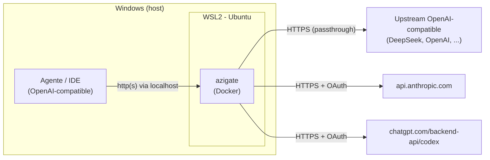

# Instalação no Windows (WSL2)

O `azigate` roda em qualquer lugar que tenha Docker — desde a migração para
adaptadores HTTP nativos, ele **não depende mais** de systemd, Bubblewrap ou user
namespaces (ver [ADR-016](../../adr/ADR-016-substituicao-do-broker-por-adaptadores-http.md)).
No Windows, a forma recomendada continua sendo rodar o servidor dentro do
**WSL2** (Windows Subsystem for Linux 2) ou usar o Docker Desktop diretamente, mas
o requisito de systemd que existia para o broker **deixou de existir**.

O seu agente ou IDE (Qwen Code, GitHub Copilot, Cline, Continue) pode continuar no
Windows normalmente — ele apenas fala HTTP com o gateway. Quem precisa do Linux é o
container Docker.



## 1. Instalar o WSL2 e uma distro Ubuntu

Em um PowerShell **como administrador**:

```powershell
wsl --install -d Ubuntu
```

Reinicie se solicitado, abra o "Ubuntu" pelo menu Iniciar e crie seu usuário Linux.
Confirme que está na versão 2:

```powershell
wsl --list --verbose
```

A coluna `VERSION` deve mostrar `2`. Se mostrar `1`, converta:

```powershell
wsl --set-version Ubuntu 2
```

Requisitos: Windows 10 22H2+ ou Windows 11, com virtualização habilitada na BIOS.

## 2. Instalar o Node.js 24 LTS

O Node.js é necessário apenas para executar os testes/gates localmente e para o
login OAuth opcional do Codex ou Claude. Instale-o dentro do Ubuntu no WSL2.

### Remover o NVM existente

Se você já instalou o NVM, remova-o antes para evitar conflito com a instalação
global do Node.js. **Não remova linhas da `.bashrc` com `sed` por palavras-chave**:
elas podem fazer parte de um bloco `if` e deixar um `fi` sem par, tornando todo
novo terminal Bash inválido.

Primeiro, faça backup e localize as linhas do NVM:

```bash
cp ~/.bashrc ~/.bashrc.backup
grep -nE 'NVM_DIR|nvm\.sh|nvm.*bash_completion' ~/.bashrc
```

Abra o arquivo e remova somente as linhas de inicialização do NVM. Se elas estiverem
dentro de um `if ... then`, remova **o bloco inteiro**, inclusive o `if` e o `fi`:

```bash
nano ~/.bashrc
```

Em seguida, remova os arquivos do NVM e valide a sintaxe antes de recarregar o
shell:

```bash
rm -rf ~/.nvm
bash -n ~/.bashrc
source ~/.bashrc
```

`bash -n` não deve imprimir nada. Se ele acusar `syntax error near unexpected token
'fi'`, o bloco de completion ficou incompleto. Restaure-o antes de usar `source`:

```bash
if ! shopt -oq posix; then
  if [ -f /usr/share/bash-completion/bash_completion ]; then
    . /usr/share/bash-completion/bash_completion
  elif [ -f /etc/bash_completion ]; then
    . /etc/bash_completion
  fi
fi
```

Esse é o bloco padrão do Ubuntu; substitua apenas o trecho quebrado no fim da
`.bashrc`, valide novamente com `bash -n ~/.bashrc` e então execute
`source ~/.bashrc`.

### Instalar Node.js e npm pelo NodeSource

Instale o Node.js 24 LTS e o npm sem NVM, pelo repositório NodeSource. O pacote
`nodejs` já inclui o npm.

```bash
curl -fsSL https://deb.nodesource.com/setup_24.x | sudo -E bash -
sudo apt install -y nodejs
```

Confirme as versões:

```bash
node --version
npm --version
```

Para instalar um pacote global, como o `pnpm`:

```bash
sudo npm install -g pnpm
pnpm --version
```

## 3. Instalar o Docker

Escolha uma das opções:

- **Docker Desktop (Windows) com integração WSL:** instale o Docker Desktop, ative
  *Settings > Resources > WSL Integration* para a sua distro Ubuntu. O comando
  `docker` fica disponível dentro do WSL2.
- **Docker Engine dentro da distro:** siga o procedimento abaixo para instalar o
  Docker Engine pelo repositório oficial do Docker no Ubuntu do WSL2.

### Docker Engine oficial no Ubuntu do WSL2

Execute o bloco completo **dentro do terminal Ubuntu no WSL2**. Ele remove pacotes
conflitantes, adiciona o repositório oficial do Docker e instala o Docker Engine
com Compose v2. O Ubuntu 24.04 (`noble`) é suportado pelos pacotes oficiais.

```bash
# Remove pacotes conflitantes, caso existam
for pkg in docker.io docker-doc docker-compose docker-compose-v2 podman-docker containerd runc; do
  sudo apt remove -y "$pkg"
done

# Instala dependências
sudo apt update
sudo apt install -y ca-certificates curl

# Adiciona a chave oficial do Docker
sudo install -m 0755 -d /etc/apt/keyrings
sudo curl -fsSL https://download.docker.com/linux/ubuntu/gpg \
  -o /etc/apt/keyrings/docker.asc
sudo chmod a+r /etc/apt/keyrings/docker.asc

# Adiciona o repositório oficial
echo \
  "deb [arch=$(dpkg --print-architecture) signed-by=/etc/apt/keyrings/docker.asc] https://download.docker.com/linux/ubuntu \
  $(. /etc/os-release && echo "${UBUNTU_CODENAME:-$VERSION_CODENAME}") stable" |
  sudo tee /etc/apt/sources.list.d/docker.list > /dev/null

# Atualiza e instala Docker Engine + Compose v2
sudo apt update
sudo apt install -y \
  docker-ce \
  docker-ce-cli \
  containerd.io \
  docker-buildx-plugin \
  docker-compose-plugin
```

Habilite o daemon e permita que o seu usuário execute Docker sem `sudo`:

```bash
sudo systemctl enable --now docker
sudo usermod -aG docker "$USER"
```

No **PowerShell do Windows**, reinicie o WSL para aplicar o novo grupo ao seu
usuário:

```powershell
wsl --shutdown
```

Abra novamente o Ubuntu e valide a instalação:

```bash
docker --version
docker compose version
docker run --rm hello-world
```

O segundo comando deve informar `Docker Compose version v2.x.x`. A partir daí, o
comando para iniciar o gateway é:

```bash
docker compose up -d
```

#### Se `systemctl` não estiver disponível

O `azigate` não exige `systemd`, mas o Docker Engine instalado dentro da distro o
usa para controlar o daemon. Se o comando anterior informar que o sistema não foi
inicializado com `systemd`, habilite-o no WSL:

```bash
sudo nano /etc/wsl.conf
```

Adicione:

```ini
[boot]
systemd=true
```

Salve o arquivo e, no PowerShell do Windows, execute novamente:

```powershell
wsl --shutdown
```

Abra o Ubuntu e repita os comandos de habilitação e validação acima. Versões atuais
do WSL suportam `systemd` para administrar serviços Linux.

Valide dentro do WSL2:

```bash
docker compose version
```

## 4. Instalar o gateway (dentro do WSL2)

A partir daqui, tudo acontece **dentro da distro Ubuntu do WSL2**. Siga o guia de
Linux, do início ao fim, no terminal do WSL2:

- [Instalação no Linux](./linux.md)

Recomenda-se guardar o projeto no sistema de arquivos do próprio WSL2 (por exemplo
`~/azigate`), e não em `/mnt/c/...`, para ter desempenho e permissões corretas.
Isso inclui o passo de login OAuth (`npm run login:codex`/`npm run login:claude`),
que abre a URL de autorização para você autenticar no navegador do Windows — o
navegador não precisa estar dentro do WSL2, só a rede precisa alcançar o
`redirect_uri` local (`localhost:1455`/`localhost:54545`), o que já funciona pelo
port forwarding padrão do WSL2.

## 5. Notas específicas do WSL2

- **Acesso pelo Windows:** por padrão, portas abertas no WSL2 ficam acessíveis via
  `localhost` no Windows (localhost forwarding). Assim, um agente rodando no Windows
  aponta para `http://localhost:3000`, e o navegador do Windows alcança a URL de
  callback do login OAuth normalmente.
- **Acesso por outros dispositivos da LAN:** o WSL2 usa um IP interno próprio.
  Publicar para outras máquinas da rede exige mapeamento de portas
  (`netsh interface portproxy`) e liberação no firewall do Windows. Para uso
  pessoal na mesma máquina, `localhost` costuma bastar.

## 6. Acessar o gateway a partir de outro PC da LAN (Windows 10 + WSL2 NAT)

No WSL2 em modo NAT, o IP interno da distro (por exemplo, `172.27.x.x`) não é
roteável diretamente por outro computador da LAN. O computador cliente deve usar o
IP físico do Windows (por exemplo, `192.168.2.4`); o Windows encaminha a porta para
o WSL. Não é necessário reiniciar o PC para criar esse encaminhamento.

O modo de rede espelhada permite acesso direto pela LAN, mas requer Windows 11
22H2 ou superior. Em Windows 10, mantenha o modo NAT e siga este procedimento.

### 6.1 Publicar a porta corretamente no WSL

No `.env` do projeto, use `0.0.0.0` para que o Docker Engine no WSL aceite a porta
em suas interfaces:

```dotenv
GATEWAY_BIND_ADDRESS=0.0.0.0
```

Não use o IP do Windows, como `192.168.2.4`, nesse campo. Ele não existe como
interface dentro do WSL e faz o Docker falhar com
`cannot assign requested address`.

Confira a configuração resolvida, suba o container e teste no próprio WSL:

```bash
docker compose config | sed -n '/ports:/,+4p'
docker compose up -d
docker compose ps
curl --fail http://127.0.0.1:3000/health
```

O trecho de `ports` deve mostrar `host_ip: 0.0.0.0`. No PowerShell do PC Windows,
confirme também o encaminhamento local padrão do WSL:

```powershell
curl.exe --fail http://127.0.0.1:3000/health
```

### 6.2 Criar o encaminhamento da LAN no Windows

Abra o **PowerShell como administrador** no PC que hospeda o WSL. O primeiro
comando obtém o IP interno atual da distro; use o nome correto caso sua distro não
se chame `Ubuntu`.

```powershell
$wslIp = (wsl.exe -d Ubuntu -- hostname -I).Trim().Split(' ', [System.StringSplitOptions]::RemoveEmptyEntries)[0]
$wslIp

netsh interface portproxy add v4tov4 `
  listenaddress=0.0.0.0 `
  listenport=3000 `
  connectaddress=$wslIp `
  connectport=3000
```

Libere somente o IP do computador cliente na regra de Firewall. No exemplo, o PC
cliente é `192.168.2.6`; substitua esse valor pelo IP correto. Inclua os perfis
`Private` e `Public`, pois a conexão Ethernet do Windows pode estar classificada
como pública mesmo em uma LAN confiável.

```powershell
New-NetFirewallRule `
  -DisplayName "azigate WSL TCP 3000 (LAN)" `
  -Direction Inbound `
  -Protocol TCP `
  -LocalPort 3000 `
  -RemoteAddress 192.168.2.6 `
  -Action Allow `
  -Profile Private,Public

netsh interface portproxy show v4tov4
```

O resultado deve ter uma linha com `0.0.0.0`, porta `3000`, e o IP atual do WSL.
O serviço Windows **Auxiliar de IP** (`iphlpsvc`) deve estar em execução para o
`portproxy` funcionar.

### 6.3 Testar pelo computador cliente

No outro PC da LAN, acesse o IP do Windows, não o IP `172.27.x.x` do WSL:

```bash
curl --connect-timeout 5 --fail http://192.168.2.4:3000/health
```

Substitua `192.168.2.4` pelo IP do PC Windows. A resposta esperada é:

```json
{"status":"ok","service":"azigate"}
```

O endpoint `/health` não exige autenticação. Para `/v1/models` e
`/v1/chat/completions`, configure o cliente com `Authorization: Bearer` usando
uma chave de `GATEWAY_API_KEYS`.

### 6.4 Atualizar depois de desligar o WSL

`wsl --shutdown`, uma reinicialização ou uma mudança de rede pode mudar o IP
interno do WSL. Quando isso ocorrer, atualize a regra de encaminhamento no
PowerShell administrativo:

```powershell
$wslIp = (wsl.exe -d Ubuntu -- hostname -I).Trim().Split(' ', [System.StringSplitOptions]::RemoveEmptyEntries)[0]

netsh interface portproxy delete v4tov4 `
  listenaddress=0.0.0.0 `
  listenport=3000

netsh interface portproxy add v4tov4 `
  listenaddress=0.0.0.0 `
  listenport=3000 `
  connectaddress=$wslIp `
  connectport=3000
```

### Diagnóstico de falha de acesso pela LAN

Se o teste no WSL e em `127.0.0.1` no Windows funcionar, mas o outro PC receber
timeout, rode no PowerShell administrativo:

```powershell
curl.exe --connect-timeout 5 --fail http://<IP_DO_WINDOWS>:3000/health
Get-Service iphlpsvc
Get-NetConnectionProfile
netstat -ano | findstr :3000
```

O primeiro comando deve responder com o JSON de saúde, `iphlpsvc` deve estar como
`Running` e `netstat` deve mostrar `0.0.0.0:3000` em `LISTENING`. Se a categoria da
rede for `Public`, confirme que a regra de Firewall inclui esse perfil, como no
passo 6.2.

### 6.5 Token OAuth criado com `sudo` retorna 500

Execute o login OAuth como o usuário normal do WSL, **sem `sudo`**. O container
executa como usuário não privilegiado e precisa ler e renovar o token montado em
`secrets/`:

```bash
npm run login:codex -- secrets/codex-oauth.json
```

Se o login só tiver funcionado com `sudo`, o arquivo provavelmente ficou como
`root:root`, com permissão `600`. O gateway então pode registrar `500` quase
imediatamente ao chamar um alias Codex. Corrija proprietário e permissões sem
exibir o conteúdo do token e recrie o gateway:

```bash
sudo chown "$USER":"$USER" secrets secrets/codex-oauth.json
sudo chmod 700 secrets
sudo chmod 600 secrets/codex-oauth.json
docker compose up -d --force-recreate gateway
```

O mesmo princípio vale para `secrets/claude-oauth.json` ao habilitar Claude.

## Problemas comuns no WSL2

- **`cannot assign requested address` ao subir o Docker:** foi usado o IP do
  Windows em `GATEWAY_BIND_ADDRESS`. Use `0.0.0.0`, conforme o passo 6.1.
- **`syntax error near unexpected token 'fi'` após remover NVM:** a `.bashrc`
  ficou com um bloco `if` incompleto. Restaure o bloco de completion e valide com
  `bash -n ~/.bashrc`, conforme o passo 2.
- **PC da LAN recebe timeout, mas `localhost` responde no Windows:** WSL2 NAT não
  expõe diretamente o IP interno `172.27.x.x`; crie o `portproxy` e a regra de
  Firewall dos passos 6.2 e 6.3. Em uma rede Windows marcada como `Public`, a
  regra deve incluir esse perfil.
- **Alias Codex retorna `500` logo após um login OAuth concluído:** o token foi
  criado por `sudo` e o usuário do container não consegue lê-lo. Aplique a
  correção do passo 6.5 e não execute o login com `sudo`.
- **O acesso LAN parou depois de `wsl --shutdown`:** o IP interno da distro mudou.
  Atualize o `portproxy` como mostrado no passo 6.4.

## Verificação

Dentro do WSL2:

```bash
curl --fail http://127.0.0.1:3000/health
curl --fail http://127.0.0.1:3000/ready
```

No Windows (PowerShell ou navegador), a mesma URL via `localhost` deve responder:

```powershell
curl.exe --fail http://localhost:3000/health
```

Se ambos respondem, siga para o
[guia de configuração do agente](../operations/openai-compatible-agents.md).

## Referências

- [Instalação no Linux](./linux.md)
- [Configurar seu agente OpenAI-compatible](../operations/openai-compatible-agents.md)
- [Arquitetura](../architecture.md)
- [Download do Node.js](https://nodejs.org/en/download)
- [Instalar Docker Engine no Ubuntu](https://docs.docker.com/engine/install/ubuntu/)
- [Usar systemd no WSL](https://learn.microsoft.com/windows/wsl/systemd)
- [Acessar aplicações de rede com WSL](https://learn.microsoft.com/windows/wsl/networking)
- [Configuração avançada do WSL](https://learn.microsoft.com/windows/wsl/wsl-config)
