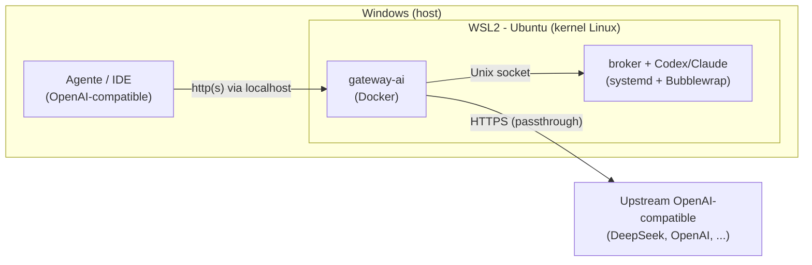

# Instalação no Windows (WSL2)

O `gateway-ai` **não roda nativamente no Windows**: ele depende de Docker, systemd,
Bubblewrap e user namespaces, que são recursos do Linux. No Windows, a forma
suportada é executar todo o stack do servidor dentro do **WSL2** (Windows Subsystem
for Linux 2), que fornece um kernel Linux real.

O seu agente ou IDE (Qwen Code, GitHub Copilot, Cline, Continue) pode continuar no
Windows normalmente — ele apenas fala HTTP com o gateway. Quem precisa do Linux é o
servidor.



## 1. Instalar o WSL2 e uma distro Ubuntu

Em um PowerShell **como administrador**:

```powershell
wsl --install -d Ubuntu
```

Reinicie se solicitado, abra o "Ubuntu" pelo menu Iniciar e crie seu usuário Linux.
Confirme que está na versão 2:

```powershell
wsl --list --verbose
```

A coluna `VERSION` deve mostrar `2`. Se mostrar `1`, converta:

```powershell
wsl --set-version Ubuntu 2
```

Requisitos: Windows 10 22H2+ ou Windows 11, com virtualização habilitada na BIOS.

## 2. Habilitar systemd no WSL2

O broker (necessário apenas para os aliases Codex/Claude) roda como serviço
`systemd`. Habilite o systemd dentro da distro editando `/etc/wsl.conf`:

```bash
sudo tee /etc/wsl.conf >/dev/null <<'EOF'
[boot]
systemd=true
EOF
```

Depois, no PowerShell, reinicie o WSL para aplicar:

```powershell
wsl --shutdown
```

Reabra o Ubuntu e confirme:

```bash
systemctl is-system-running
```

Uma resposta `running` (ou `degraded`) indica que o systemd está ativo. Se você for
usar **apenas o modo passthrough** (só o upstream), o systemd não é obrigatório, mas deixá-lo ligado
não atrapalha.

## 3. Instalar o Docker

Escolha uma das opções:

- **Docker Desktop (Windows) com integração WSL:** instale o Docker Desktop, ative
  *Settings > Resources > WSL Integration* para a sua distro Ubuntu. O comando
  `docker` fica disponível dentro do WSL2.
- **Docker Engine dentro da distro:** instale o Docker Engine diretamente no Ubuntu
  do WSL2 (pacote `docker.io` ou o repositório oficial). Como o systemd está
  ativo, o serviço `docker` inicia normalmente.

Valide dentro do WSL2:

```bash
docker compose version
```

## 4. Instalar o gateway (dentro do WSL2)

A partir daqui, tudo acontece **dentro da distro Ubuntu do WSL2**. Siga o guia de
Linux, do início ao fim, no terminal do WSL2:

- [Instalação no Linux](./linux.md)

Recomenda-se guardar o projeto no sistema de arquivos do próprio WSL2 (por exemplo
`~/gateway-ai`), e não em `/mnt/c/...`, para ter desempenho e permissões corretas.

## 5. Notas específicas do WSL2

- **Acesso pelo Windows:** por padrão, portas abertas no WSL2 ficam acessíveis via
  `localhost` no Windows (localhost forwarding). Assim, um agente rodando no Windows
  aponta para `http://localhost:3000`.
- **Acesso por outros dispositivos da LAN:** o WSL2 usa um IP interno próprio.
  Publicar para outras máquinas da rede exige mapeamento de portas
  (`netsh interface portproxy`) e liberação no firewall do Windows. Para uso
  pessoal na mesma máquina, `localhost` costuma bastar.
- **Aliases Codex/Claude no WSL2:** Bubblewrap e user namespaces dependem da
  configuração do kernel do WSL2 e podem exigir ajustes de AppArmor. Comece sempre
  em **modo passthrough** (só o upstream); só depois tente habilitar os aliases seguindo o
  [runbook do broker](../operations/broker.md). Se o health do broker retornar
  `bwrap_unavailable`, os aliases ficam indisponíveis até o isolamento validar.

## Verificação

Dentro do WSL2:

```bash
curl --fail http://127.0.0.1:3000/health
curl --fail http://127.0.0.1:3000/ready
```

No Windows (PowerShell ou navegador), a mesma URL via `localhost` deve responder:

```powershell
curl.exe --fail http://localhost:3000/health
```

Se ambos respondem, siga para o
[guia de configuração do agente](../operations/openai-compatible-agents.md).

## Referências

- [Instalação no Linux](./linux.md)
- [Instalação e operação do broker](../operations/broker.md)
- [Configurar seu agente OpenAI-compatible](../operations/openai-compatible-agents.md)
- [Arquitetura](../architecture.md)
