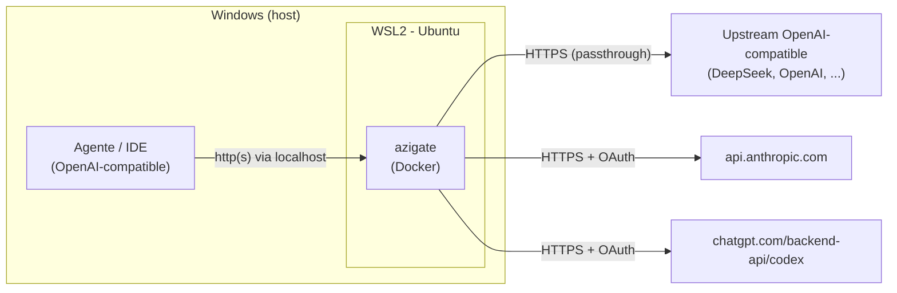

# Instalação no Windows (WSL2)

O `azigate` roda em qualquer lugar que tenha Docker — desde a migração para
adaptadores HTTP nativos, ele **não depende mais** de systemd, Bubblewrap ou user
namespaces (ver [ADR-016](../../adr/ADR-016-substituicao-do-broker-por-adaptadores-http.md)).
No Windows, a forma recomendada continua sendo rodar o servidor dentro do
**WSL2** (Windows Subsystem for Linux 2) ou usar o Docker Desktop diretamente, mas
o requisito de systemd que existia para o broker **deixou de existir**.

O seu agente ou IDE (Qwen Code, GitHub Copilot, Cline, Continue) pode continuar no
Windows normalmente — ele apenas fala HTTP com o gateway. Quem precisa do Linux é o
container Docker.



## 1. Instalar o WSL2 e uma distro Ubuntu

Em um PowerShell **como administrador**:

```powershell
wsl --install -d Ubuntu
```

Reinicie se solicitado, abra o "Ubuntu" pelo menu Iniciar e crie seu usuário Linux.
Confirme que está na versão 2:

```powershell
wsl --list --verbose
```

A coluna `VERSION` deve mostrar `2`. Se mostrar `1`, converta:

```powershell
wsl --set-version Ubuntu 2
```

Requisitos: Windows 10 22H2+ ou Windows 11, com virtualização habilitada na BIOS.

## 2. Instalar o Docker

Escolha uma das opções:

- **Docker Desktop (Windows) com integração WSL:** instale o Docker Desktop, ative
  *Settings > Resources > WSL Integration* para a sua distro Ubuntu. O comando
  `docker` fica disponível dentro do WSL2.
- **Docker Engine dentro da distro:** instale o Docker Engine diretamente no Ubuntu
  do WSL2 (pacote `docker.io` ou o repositório oficial).

Valide dentro do WSL2:

```bash
docker compose version
```

## 3. Instalar o gateway (dentro do WSL2)

A partir daqui, tudo acontece **dentro da distro Ubuntu do WSL2**. Siga o guia de
Linux, do início ao fim, no terminal do WSL2:

- [Instalação no Linux](./linux.md)

Recomenda-se guardar o projeto no sistema de arquivos do próprio WSL2 (por exemplo
`~/azigate`), e não em `/mnt/c/...`, para ter desempenho e permissões corretas.
Isso inclui o passo de login OAuth (`npm run login:codex`/`npm run login:claude`),
que abre a URL de autorização para você autenticar no navegador do Windows — o
navegador não precisa estar dentro do WSL2, só a rede precisa alcançar o
`redirect_uri` local (`localhost:1455`/`localhost:54545`), o que já funciona pelo
port forwarding padrão do WSL2.

## 4. Notas específicas do WSL2

- **Acesso pelo Windows:** por padrão, portas abertas no WSL2 ficam acessíveis via
  `localhost` no Windows (localhost forwarding). Assim, um agente rodando no Windows
  aponta para `http://localhost:3000`, e o navegador do Windows alcança a URL de
  callback do login OAuth normalmente.
- **Acesso por outros dispositivos da LAN:** o WSL2 usa um IP interno próprio.
  Publicar para outras máquinas da rede exige mapeamento de portas
  (`netsh interface portproxy`) e liberação no firewall do Windows. Para uso
  pessoal na mesma máquina, `localhost` costuma bastar.

## Verificação

Dentro do WSL2:

```bash
curl --fail http://127.0.0.1:3000/health
curl --fail http://127.0.0.1:3000/ready
```

No Windows (PowerShell ou navegador), a mesma URL via `localhost` deve responder:

```powershell
curl.exe --fail http://localhost:3000/health
```

Se ambos respondem, siga para o
[guia de configuração do agente](../operations/openai-compatible-agents.md).

## Referências

- [Instalação no Linux](./linux.md)
- [Configurar seu agente OpenAI-compatible](../operations/openai-compatible-agents.md)
- [Arquitetura](../architecture.md)
